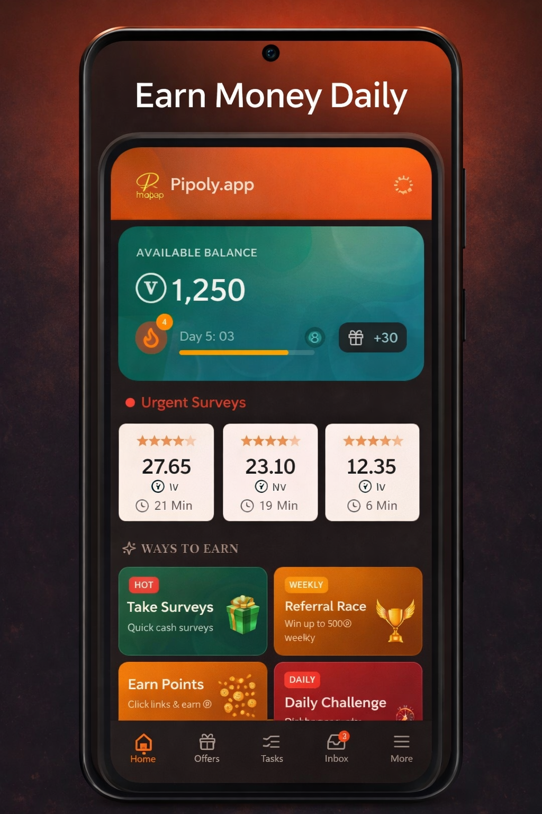
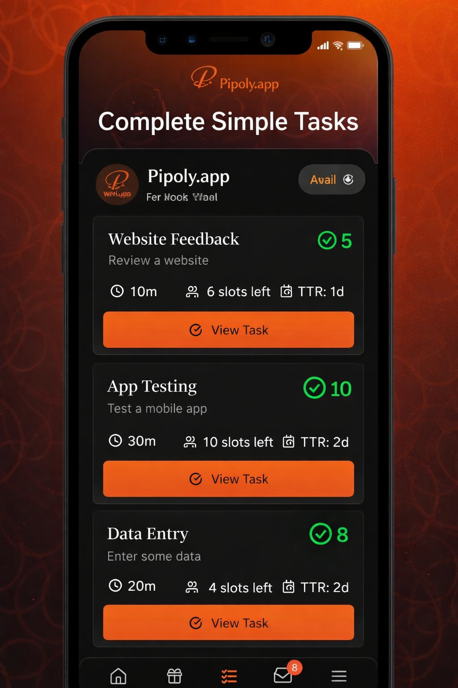
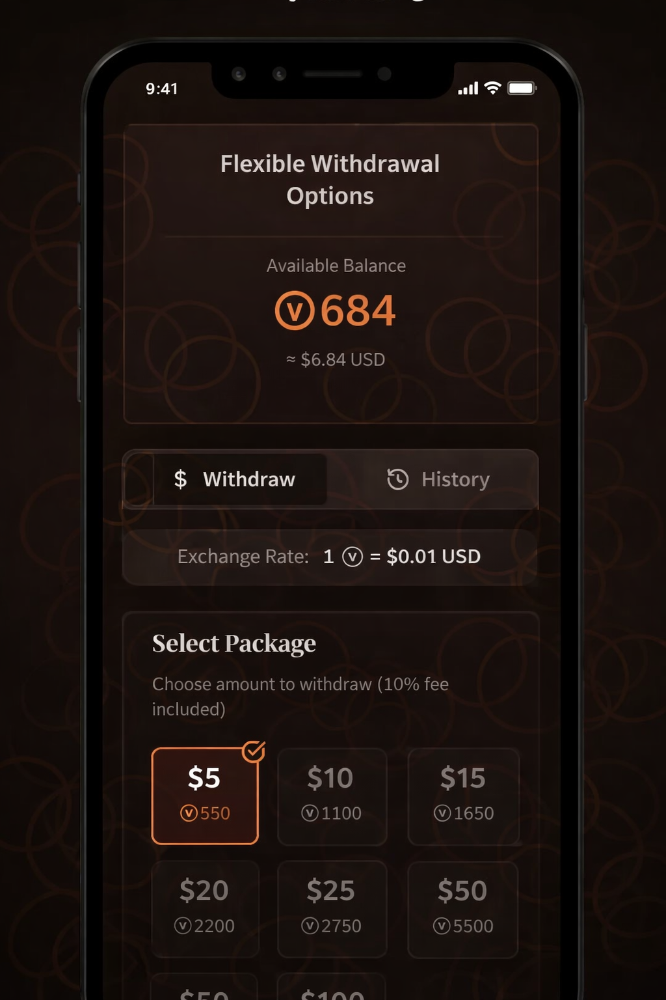

# Pipoly.app: Empowering Global Microtasking and Freelancing

## Overview

Pipoly.app stands as a pioneering platform at the intersection of microtasking and freelancing, meticulously designed to connect individuals seeking flexible earning opportunities with businesses and individuals requiring efficient, distributed work completion. Our ecosystem fosters a dynamic environment where micro-entrepreneurs can leverage their skills to earn income from virtually anywhere, while employers gain access to a global workforce capable of executing diverse tasks with precision and speed. This repository serves as a comprehensive public hub for community engagement, issue tracking, and transparent communication regarding the Pipoly.app platform.

## The Pipoly.app Vision

In an increasingly interconnected world, Pipoly.app addresses the growing demand for flexible work arrangements and scalable task management solutions. Our vision is to democratize access to earning opportunities and streamline the process of outsourcing micro-tasks, thereby empowering a global community of workers and facilitating efficient project completion for employers. We believe in a future where earning potential is not limited by geographical boundaries or traditional employment structures.

## Key Features and Benefits

Pipoly.app offers a robust suite of features tailored to meet the needs of both its worker and employer communities.

### For Workers: Unlock Your Earning Potential

Workers on Pipoly.app can engage in a variety of activities designed to maximize their earning potential, all while maintaining flexibility and control over their work schedule.

*   **Diverse Microtask Opportunities:** Participate in a wide array of microtasks, ranging from data entry and content categorization to verification processes, each offering clear compensation per approved submission.
*   **Paid Surveys:** Contribute valuable insights through surveys powered by leading research platforms such as CPX Research, earning rewards for your opinions on products, services, and market trends.
*   **App Install Earnings:** Generate income through strategic app installations facilitated by partnerships with platforms like OGAds, expanding earning avenues beyond traditional tasks.
*   **Competitive Gaming:** Engage in skill-based games such as Chess, Connect Four, and Tic-Tac-Toe, where Value (ⓥ), Pipoly's virtual currency, can be wagered and won, adding an exciting dimension to earning.
*   **Daily Challenges:** Test your abilities with daily challenges, including strategic encounters against an AI in the Nim game, offering amplified rewards for successful completion.
*   **Interactive Polls:** Participate in daily polls, providing quick and easy opportunities to accumulate earnings through minimal effort.
*   **Earning Links:** Accumulate Points (ⓟ) by interacting with earning links, which are subsequently convertible into Value (ⓥ).
*   **Referral Leaderboard:** Ascend the referral leaderboard by inviting new users to the platform, competing for weekly prize pools and fostering community growth.
*   **Flexible Withdrawals:** Conveniently withdraw earned funds via established payment gateways such as PayPal and M-Pesa, ensuring accessibility and reliability.

### For Employers: Efficient Task Management and Global Workforce Access

Employers leverage Pipoly.app to efficiently manage projects, access a diverse global talent pool, and ensure timely completion of tasks.

*   **Customizable Task Posting:** Define and post tasks with granular control over proof requirements, deadlines, and specific instructions, ensuring alignment with project objectives.
*   **Targeted Worker Selection:** Precisely target workers based on geographical location, performance ratings, or specific qualifications, optimizing task allocation for desired outcomes.
*   **Escrow-Based Fund Security:** Funds allocated for tasks are held securely in escrow, released only upon the employer's approval of submitted work, guaranteeing fair compensation and quality assurance.
*   **Performance Rating System:** Evaluate worker submissions and provide ratings, contributing to the development of a trusted and high-performing workforce.
*   **Comprehensive Analytics:** Monitor task progress and analyze submission data through intuitive dashboards, providing actionable insights into project efficiency and worker performance.
*   **Promotional Campaigns:** Create and manage promotional codes and reward campaigns to incentivize worker participation and enhance task visibility.

## Supported Languages

Pipoly.app is committed to global accessibility, offering its platform in **14 languages**, including but not limited to Arabic, Spanish, French, Portuguese, Swahili, and Hindi, ensuring a seamless experience for a diverse international user base.

## Currency and Withdrawal Mechanisms

Pipoly.app utilizes a proprietary virtual currency, **Value (ⓥ)**, to facilitate transactions within its ecosystem. The conversion rates and withdrawal options are structured for clarity and user convenience.

| Method | Minimum Withdrawal | Fee Structure |
|:-------|:-------------------|:--------------|
| PayPal | $5.00 USD | 10% of withdrawal amount |
| M-Pesa | 50 ⓥ | 30% for withdrawals under 250 ⓥ; 10% for withdrawals 250 ⓥ and above |

**Conversion Rate:** 10 Points (ⓟ) = 1 Value (ⓥ)

**Value to USD Exchange Rate:** 1 ⓥ = $0.01 USD

**Value to KES (Kenya) Exchange Rate:** 1 ⓥ = 1.2 KES

## Mobile Application

The Pipoly.app mobile experience is delivered through a native Android application, developed with **Capacitor 8**, ensuring a responsive and integrated user interface. The application is available on the Google Play Store.

**App ID:** `com.codeverix.pipoly`

## Screenshots

Experience the intuitive design and comprehensive functionality of Pipoly.app through these high-quality screenshots, optimized for the Google Play Store.

### 1. Earn Money Daily

### 2. Many Ways to Earn

### 3. Complete Simple Tasks

### 4. Flexible Withdrawal Options

### 5. Play Games, Win Rewards

## Bug Reports and Feature Requests

We highly value community feedback for the continuous improvement of Pipoly.app. Should you encounter any bugs or have suggestions for new features, we encourage you to engage with our development process.

To report an issue or propose a feature, please utilize our [GitHub Issues](../../issues/new/choose) page. When submitting, kindly include:

*   A clear and concise description of the problem or proposed idea.
*   Detailed steps to reproduce the bug, if applicable.
*   Information regarding your device and browser environment.
*   Relevant screenshots to illustrate the issue or concept.

## Changelog

For a comprehensive history of updates, enhancements, and releases, please refer to the [CHANGELOG.md](./CHANGELOG.md) file within this repository.

## Roadmap

Pipoly.app is committed to continuous innovation and expansion. Our strategic roadmap includes several key development areas:

*   **iOS Application Development:** Expansion to the iOS platform using Capacitor.
*   **Enhanced Gaming Options:** Introduction of additional competitive game types to enrich the user experience.
*   **Diversified Withdrawal Methods:** Integration of more withdrawal options to cater to a broader global audience.
*   **Employer Subscription Tiers:** Implementation of tiered subscription models for employers, offering advanced features and benefits.
*   **Public API:** Development of a public API to facilitate seamless task integrations with external systems.

We welcome community input on our roadmap. Feel free to [start a discussion](../../discussions/new) or [open a feature request](../../issues/new?template=feature_request.md) with your ideas.

## Important Links

| Resource | Link |
|:---------|:-----|
| Web Application | [pipoly.app](https://pipoly.app) |
| Android Application | [Google Play Store](https://play.google.com/store/apps/details?id=com.codeverix.pipoly) |
| GitHub Issues | [GitHub Issues](../../issues) |
| GitHub Discussions | [GitHub Discussions](../../discussions) |

## License

Pipoly.app operates as proprietary software. All intellectual property rights are reserved by © Codeverix. This repository is intended solely as a public interface for community interaction, issue tracking, and the dissemination of changelogs, and does not contain the platform's source code.
